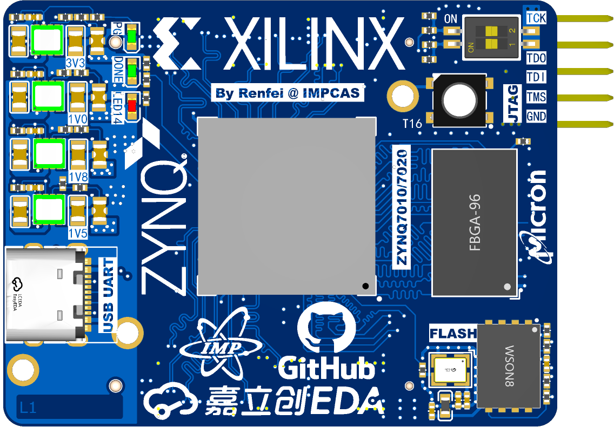
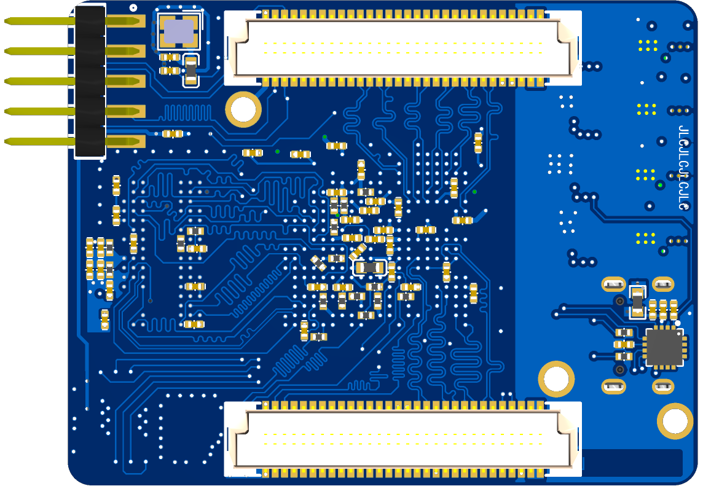

# hw-zynq7020-core-board

## Images (3D Model Render)

## Manufacturing [TBD]
### V1.0 (JTAG bug)

### V1.1 (JTAG bug fixed)

## References
- [Components & DDR layout](https://oshwhub.com/z_star/zynq7020-core-board-and-various-rf-modules)
  - Power Supply layout overhaul
  - Ground plane layout overhaul
  - Keep DDR3L layout
  - Re-arrange Components
  - Remove SD Card Level Shifter
